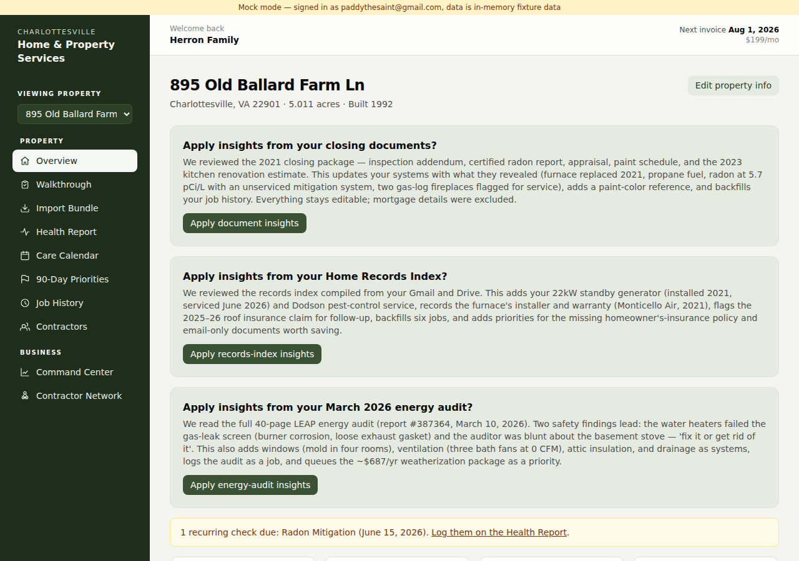
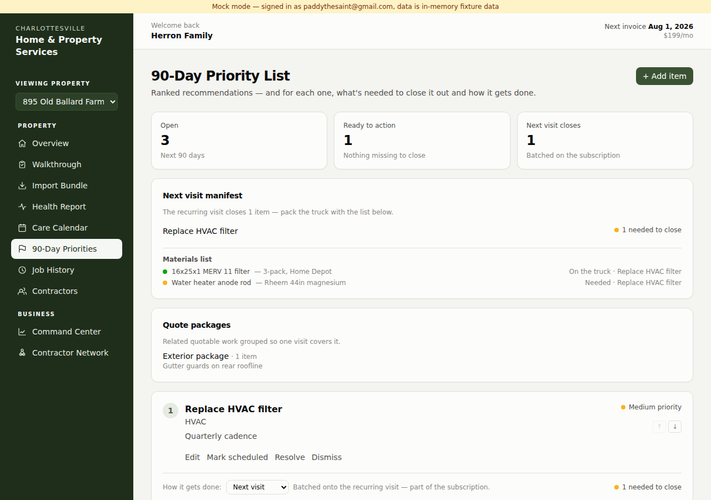
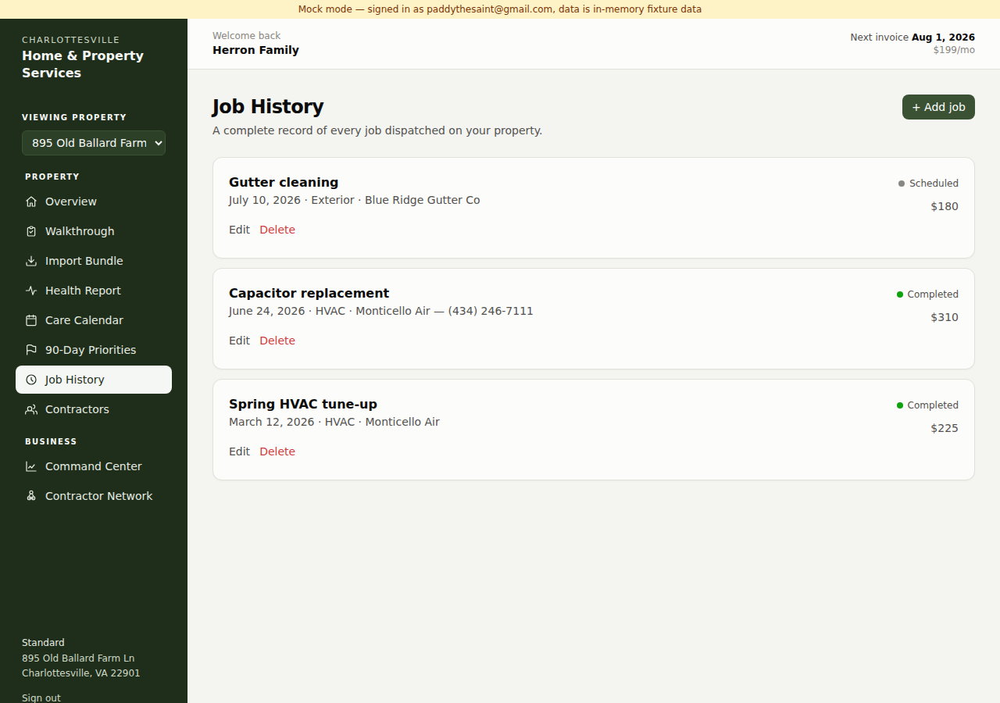
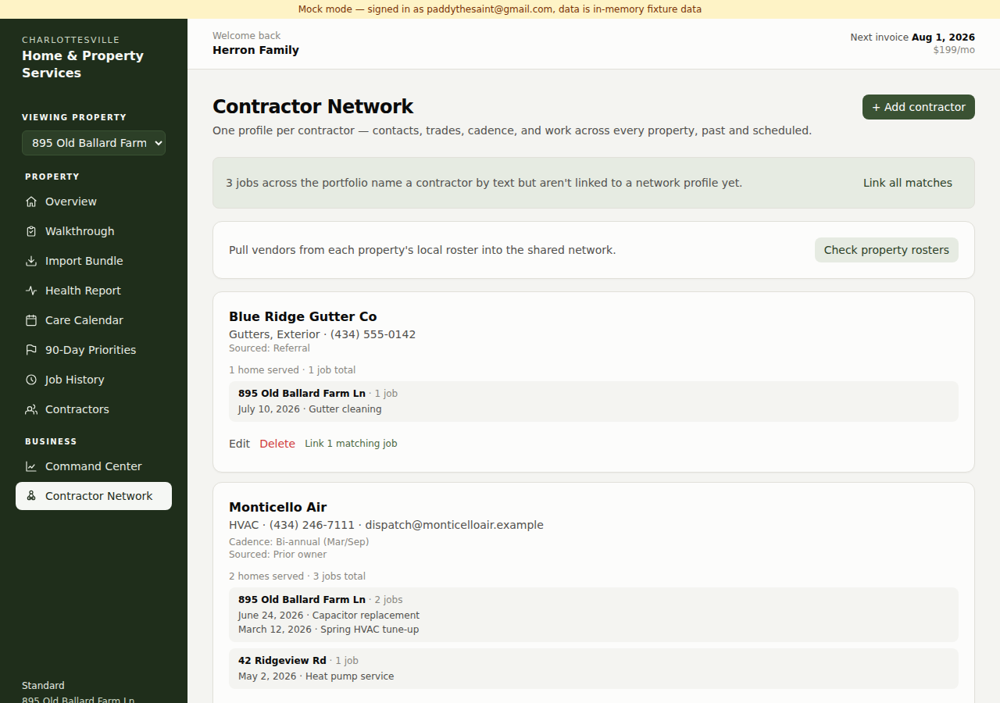
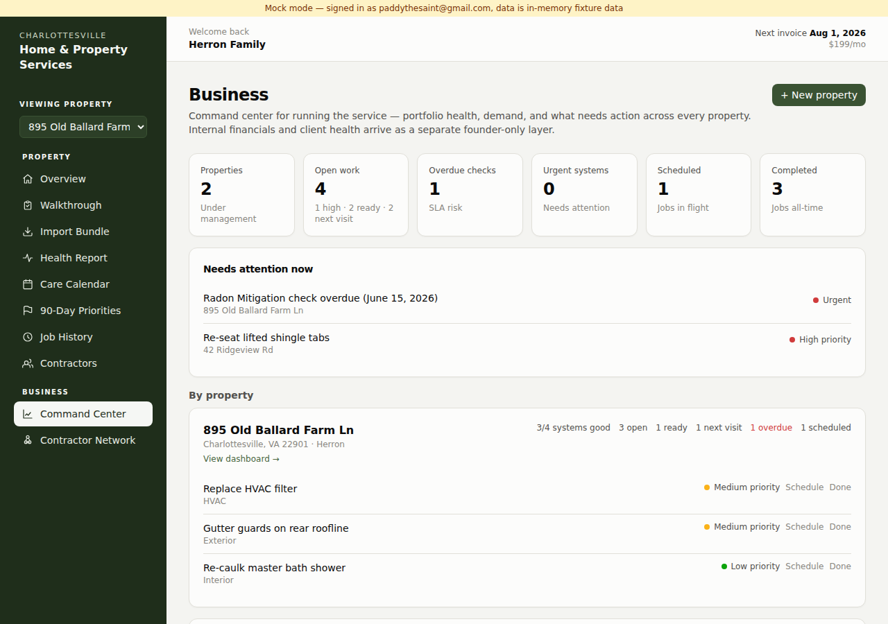
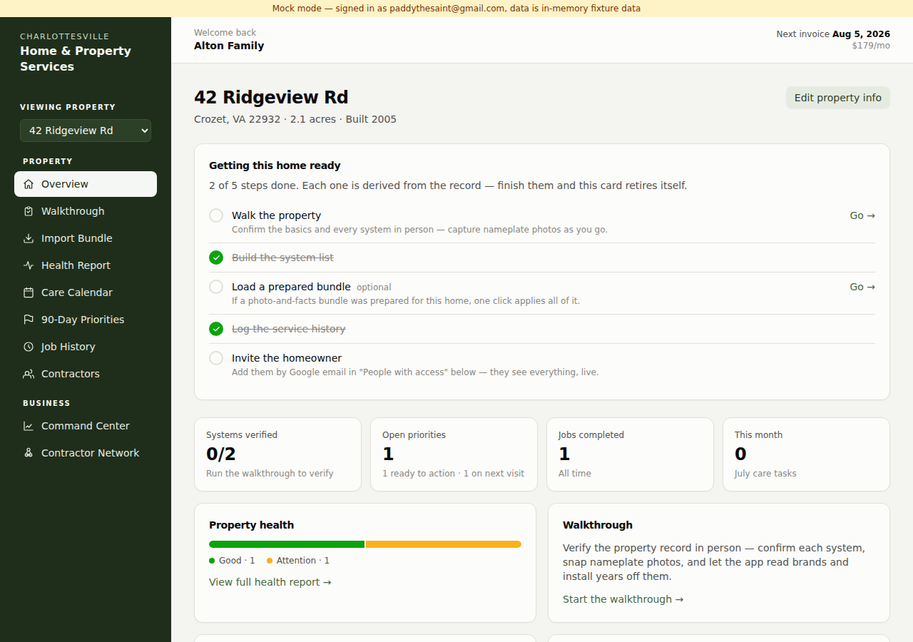

# Demo pack — showing a co-founder the two-house operation

Written for the first co-founder walkthrough: what to do before he
arrives, the story to tell, a 15-minute click-path with screenshots, the
scale argument, and honest answers to the questions he should ask.

> Screenshots in `docs/screenshots/` come from the fixture-data preview
> (`npm run preview:mock` — note the amber banner), so no client data
> lives in the repo. The live demo runs on the real site with the real
> 895 Old Ballard record, which is far richer.

---

## Before the demo (morning checklist, ~10 minutes)

1. **Publish the Firestore rules** — RUNBOOK.md, one paste. Without this,
   the Contractor Network and "+ New property" fail live, in front of him.
2. **Run System status** (Command Center → bottom card → Run checks).
   All green = production verified, not assumed. This panel is itself
   worth showing him — it's the "we run this like an operation" tell.
3. **Data hygiene**: click "Remove orphaned API keys" on the same card,
   then rotate the old key at console.anthropic.com.
4. Optional but high-impact: **pre-create his property** ("+ New
   property" on the Command Center) and fill what you already know from
   INTAKE.md. Walking in with his own address on the switcher beats any
   slideware.

## The one-sentence pitch

A subscription home-services operation whose moat is the **property
record**: every system, its condition, its history, its provenance —
kept alive by a recurring visit, so small problems get closed out at
near-zero marginal cost before they become big ones.

The prioritization principle behind the product is **resolution
proximity**: for every open item, what information or materials are
missing to close it, and which path closes it (batched onto the next
subscription visit, DIY with a supplied materials list, a specialist
dispatch, or a bundled project quote). The dashboard is that principle
made visible.

## The two planes

- **Property plane** (what a homeowner sees): Overview, Health Report,
  Care Calendar, 90-Day Priorities, Job History, their vendor roster.
  Scoped by membership — Sally sees the house she co-owns, nothing else.
- **Business plane** (founders only): the Command Center portfolio view,
  the cross-property Contractor Network, System status. A homeowner
  never sees these; the founder allowlist plus Firestore rules enforce it.

One codebase, one database, two audiences. That's the operating-system
claim.

---

## The 15-minute demo script

**Stop 1 — the rich record (Overview, 895 Old Ballard).**

Open on your own house. Point at: systems verified in person during the
walkthrough, condition meter, open-priorities tile showing the pipeline
("N ready to action · N on next visit"). The story: *this took a
walkthrough, a photo bundle, and our closing documents — every fact
traces to a source.* Open any system's activity feed and show a "Fact
recorded · via Imported bundle" line: provenance, not vibes.

**Stop 2 — resolution pipeline (90-Day Priorities).**

This is the money screen for the operating model. Walk one item: what's
needed to close it (materials with statuses — needed / purchased / on the
truck; info asks), and how it gets actioned. Show the **Next visit
manifest** — the truck-packing list — and **Quote packages** bundling
related exterior work into one contractor trip. *Subscription economics
live here: ten small closeouts on one scheduled visit.*

**Stop 3 — history and the network (Job History → Contractor Network).**

Job History is the per-home ledger; the founder-only picker links each
job to a real contractor profile at creation. Then flip to the Business
plane: one profile per contractor across the whole portfolio — "2 homes
served · 3 jobs total", grouped by home. *At twenty houses this is
vendor management: who's reliable, who covers which trades, who earns
the next dispatch.*

**Stop 4 — the operation (Command Center).**

Portfolio totals, the cross-property "needs attention now" feed (high
urgency + overdue checks), per-home rollups with health chips, and
System status at the bottom — live proof the deployed permissions match
the code. *This is the screen you'd run the morning dispatch from.*

**Stop 5 — his house (the closer).**

Switch properties (sidebar switcher) or hit "+ New property" and create
his, live. The **"Getting this home ready"** checklist appears on any
new home — walk it, build the system list, load a bundle, log history,
invite the homeowner — every tick derived from the record. Hand him
INTAKE.md and tell him his house will look like Stop 1 within a week of
the walkthrough.

---

## The scale story (what N=20 looks like on these same screens)

- **Attention feed** becomes the dispatch queue — every overdue check
  and high-urgency item across the book, ranked, with the address on it.
- **Visit manifests** become route planning — each home's next-visit
  batch is a packing list; a day's schedule is three manifests.
- **Quote packages** become sales — bundled, spec'd work handed to a
  contractor is a margin opportunity, not an errand.
- **Contractor Network** becomes supply management — coverage by trade,
  jobs by home, and (later) response-time and pricing history.
- **Onboarding checklist** is the unit of growth — "onboard a home" is a
  repeatable, checkable process a technician can run, not founder magic.
- Same rules, same code, zero schema work: properties are the tenant
  boundary, membership is the access model. Adding house #20 is a
  five-minute create-and-invite, which he'll have just watched happen.

## What's real vs. what isn't yet (say this before he asks)

- **Real and shipped**: everything above; 48 automated tests gate every
  deploy; the app self-diagnoses permission drift; no secrets live in
  the client anymore.
- **Manual today**: rules publish is a console paste (RUNBOOK.md);
  onboarding data entry is walkthrough + prepared bundles, not magic.
- **Deliberately removed**: the in-app AI assistant — it required an API
  key in the browser, which is unacceptable; it returns when there's a
  real backend to hold the key.
- **Costs**: Firebase free tier + GitHub Pages = effectively $0
  infrastructure at this scale. The first real infra cost arrives with
  the backend (AI proxy / integrations), and it's small.

## Questions he should ask, answered honestly

- *"Why not a spreadsheet?"* — A spreadsheet holds facts; it doesn't
  compute readiness, batch work onto visits, bundle quotes, track
  provenance, or give a homeowner a live view. The pipeline math is the
  product.
- *"What's defensible here?"* — The accumulated, provenance-tracked
  record per home, and the operating discipline built around it. Copying
  the UI is easy; copying two years of verified property history isn't.
- *"What breaks at 50 homes?"* — Nothing structural (tenant-per-property
  is standard). What's actually needed: a real backend for AI/automation,
  photo storage off Firestore base64, and scheduling/route tooling. All
  known, none started, sequenced behind demand.
- *"What if you disappear?"* — It's a standard React + Firebase app in a
  git repo with tests, a schema audit (SCHEMA.md), a rules runbook
  (RUNBOOK.md), and a documented backlog (BACKLOG.md). Any competent
  developer picks it up cold.

## After the demo

Work through INTAKE.md together (founders can fill it directly — real clients get the welcome-call treatment instead), book his walkthrough, and let the onboarding
checklist drive the rest. The goal isn't applause — it's his house in
the system by next week, because two real homes under management is the
proof, and the third will be someone who isn't a founder.
